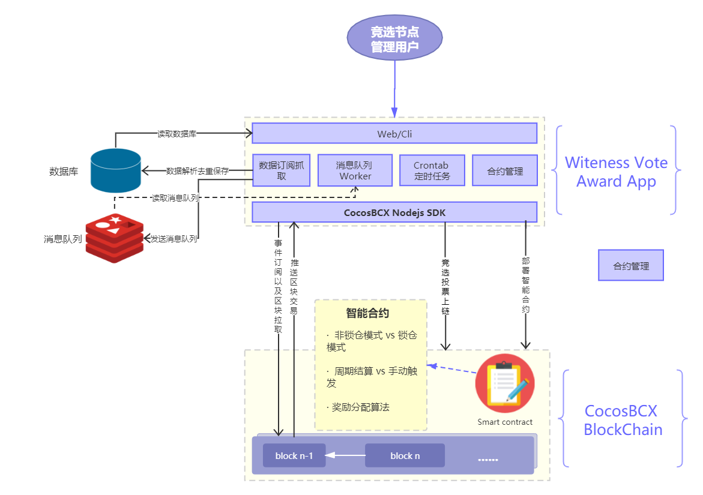

# cocosbcx-witnode-vote-award
COCOSBCX witness node voting award system 
[](https://travis-ci.org/joemccann/dillinger)

# Introduction

 COCOSBCX witness node voting award system is aimed to help the witness node operator to award the voting community users.
  - One click to deployment for the voting award smart contract
  - Automatically subscribe & scrape user voting operations
  - Automatically upload voting operations to smart contract 
  - Transparent cocos awarding pool distribution triggered by smart contract
 


# Architecture

This application is mainly split into two layers, the application layer and  the smart contract layer:
[](#)


### Tech

This application uses a number of open source projects to work properly:

* [node.js] - evented I/O for the backend

### Installation

Dillinger requires [Node.js](https://nodejs.org/) v4+ to run.

Install the dependencies and devDependencies and start the server.

```sh
$ cd cocosbcx-witnode-vote-award
$ npm install -d
$ node app
```

For production environments...

```sh
$ npm install --production
$ NODE_ENV=production node app
```

### Plugins

Dillinger is currently extended with the following plugins. Instructions on how to use them in your own application are linked below.

| Plugin | README |
| ------ | ------ |
| Dropbox | [plugins/dropbox/README.md][PlDb] |
| GitHub | [plugins/github/README.md][PlGh] |
| Medium | [plugins/medium/README.md][PlMe] |
| Google Analytics | [plugins/googleanalytics/README.md][PlGa] |

### Development

Want to contribute? Great!

Dillinger uses Gulp + Webpack for fast developing.
Make a change in your file and instantaneously see your updates!

Open your favorite Terminal and run these commands.

First Tab:
```sh
$ node app
```

Second Tab:
```sh
$ gulp watch
```

(optional) Third:
```sh
$ karma test
```
#### Building for source
For production release:
```sh
$ gulp build --prod
```
Generating pre-built zip archives for distribution:
```sh
$ gulp build dist --prod
```
### Docker
Dillinger is very easy to install and deploy in a Docker container.

By default, the Docker will expose port 8080, so change this within the Dockerfile if necessary. When ready, simply use the Dockerfile to build the image.

```sh
cd dillinger
docker build -t {youruser}/cocosbcx-witnode-vote-award:${package.json.version} .
```
This will create the cocosbcx-witnode-vote-award image and pull in the necessary dependencies. Be sure to swap out `${package.json.version}` with the actual version of cocosbcx-witnode-vote-award.

Once done, run the Docker image and map the port to whatever you wish on your host. In this example, we simply map port 8000 of the host to port 8080 of the Docker (or whatever port was exposed in the Dockerfile):

```sh
docker run -d -p 8000:8080 --restart="always" <youruser>/dillinger:${package.json.version}
```

Verify the deployment by navigating to your server address in your preferred browser.

```sh
127.0.0.1:8000
```

### Todos

 - Write MORE Tests
 - Add Night Mode

License
----

Apache


**Free Software, Hell Yeah!**

[//]: # (These are reference links used in the body of this note and get stripped out when the markdown processor does its job. There is no need to format nicely because it shouldn't be seen. Thanks SO - http://stackoverflow.com/questions/4823468/store-comments-in-markdown-syntax)

